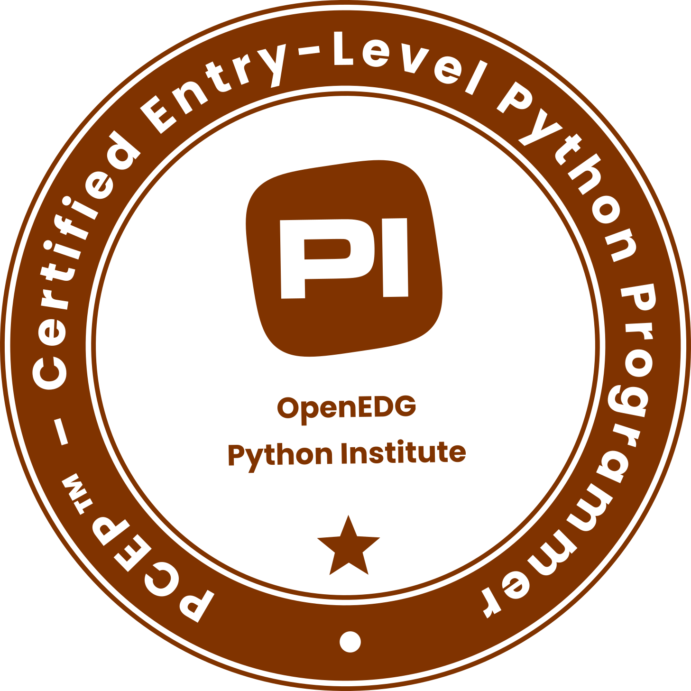
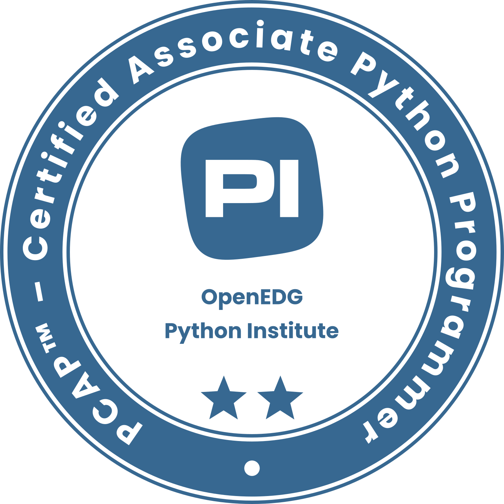
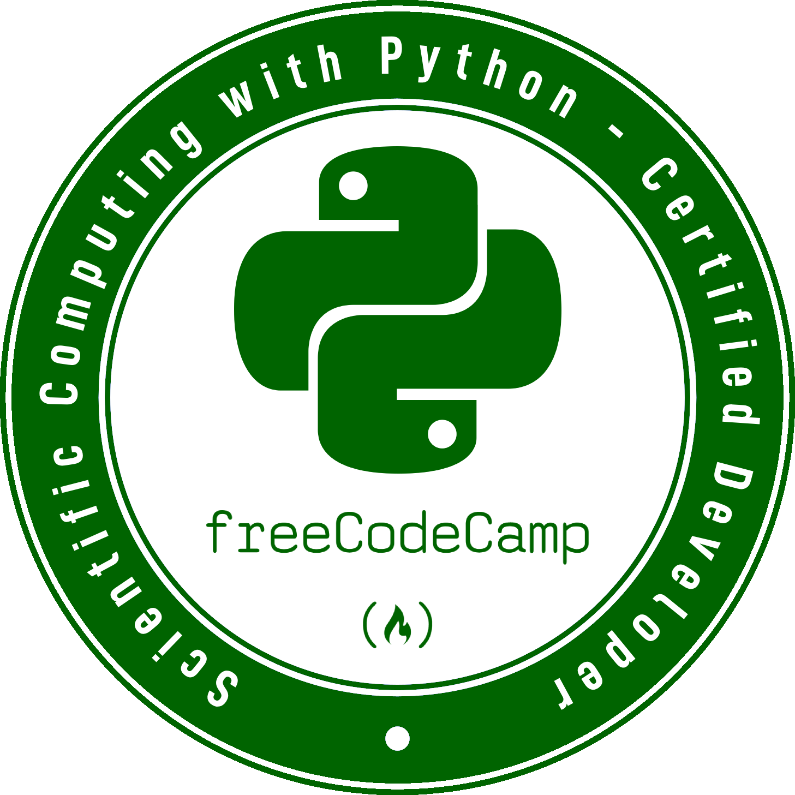

# Learning Python

A systematic approach to Python programming from fundamentals to practical applications.

## Certifications

  

- **PCEP - Certified Entry-Level Python Programmer** by OpenEDG Python Institute
- **PCAP - Certified Associate Python Programmer** by OpenEDG Python Institute
- **Scientific Computing with Python** by FreeCodeCamp

## Structure

- `concepts/`: Jupyter notebooks demonstrating Python principles
- `projects/`: Applications showcasing practical implementations

## Resources

- **OpenEDG Python Institute**:
  - Python Essentials 1 (Aligned with PCEP)
  - Python Essentials 2 (Aligned with PCAP)
- **Khan Academy**:
  - Intro to Computer Science - Python
- **FreeCodeCamp**:
  - Scientific Computing with Python
- **John V. Guttag**:
  - Introduction to Computation and Programming Using Python
- **School of Certified Professionals (SCP)**:
  - Python Essentials Course

## Contact

- GitHub: [@KostasAndroulidakis](https://github.com/KostasAndroulidakis)
- Email: [kostasandroulidakis.pro@gmail.com](mailto:kostasandroulidakis.pro@gmail.com)
